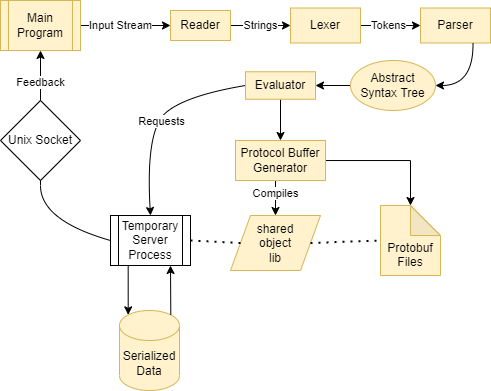

# database
Simple SQL Implementation

## Building
```
cmake -S . -B build && cmake --build build && ./build/sql_test && ./build/main << ./PA1_test.sql
```

## Overview
This project features a lexer, parser, evaluator for SQL. It also features a protocol buffer generator which is generated when SQL commands are read. The data models are stored as database models which also have commented metadata in order to conver it back to a "SQL-like" type.
Input is first read through a lexer to generate tokens, the tokens are then ran through a parser to generate an abstract syntax tree. The tree features expressions and statements. The expressions can be further evaluated and statements are expected to complete some type of action. In the evaluator, a mapping of lambdas and AST node keys allow for dynamic execution based on type. 

## Design

The diagram is pretty self-explanatory. Data is serialized and stored using Google's Protocol Buffers. The database interface allows for the creation of .proto files which are then compiled into a dynamic library and used on a new thread or process and responses are relayed back via IPC.

## Bugs
The program is pretty complex and needs to shift to smart pointers. Currently there are some allocation/deallocation issues.
There are also some issues with hashing functions in unordered_map, with our complex types so a custom implementation may be needed.

